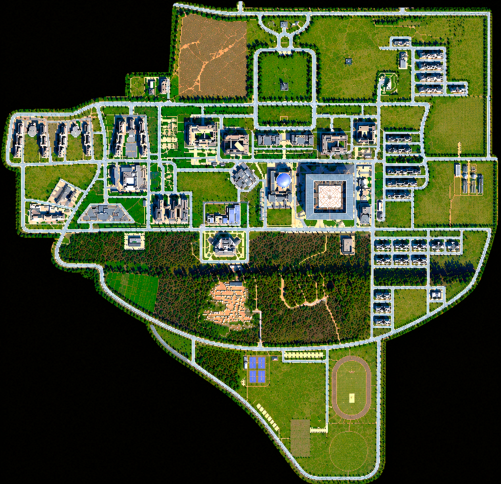

# Valhalla

A multi-agent simulation of IIT Ropar where AI student personas plan their day,
move around a campus map, talk when they meet, and remember past experiences.

<video src="Valhalla_run_1.mp4" controls width="100%">
  Your browser does not support the video tag.
</video>

## Pipeline

```
Load Personas → Generate Day Plans → Start Clock
                                          │
                              ┌─────────────┘
                              ▼
              ┌──── Perceive (each tick) ◄──┐
              │                             │
              ▼                             │
        Detect Conversations                │
              │                             │
              ▼                             │
      LLM Decide: continue/replan          │
              │                             │
              ▼                             │
        Replan if needed                   │
              │                             │
              ▼                             │
          Advance agents ──────────────────┘
                    (repeat for 1440 ticks / 1 day)
                              │
                              ▼
                Archive Day → Next Day Plans
```

## How It Works

### Perceive

Every few ticks, each agent checks who is nearby . If something changes, the agent's
internal state is flagged as "something changed." No LLM is involved here --
it's just spatial math. When something new is observed, the agent saves a short
memory like *"At 08:05 near mess, saw Tanishq studying."*

### Day Planner

Each student gets a full-day schedule generated by Gemini through a 4-step process:

1. **Coarse plan** -- 5-8 broad time blocks (e.g., "Sleep 00:00-07:00", "Classes 09:00-12:00")
2. **Hourly breakdown** -- flexible blocks are split into hourly sub-blocks
3. **Fine breakdown** -- down to 5-15 min actions with specific campus locations
4. **Validation** -- checks for overlaps, valid locations, and persona coherence; retries on conflict

Plans adapt mid-day. If an agent's LLM decides to replan (e.g., after an unexpected conversation), the planner regenerates the rest of the day with current context.

### Conversation

When two eligible agents are within 50px and both are free, a conversation triggers:

- Both pause their current activity and engage in a conversation.
- The conversation affects their energy, emotion, and how they feel about each other
- After the generated duration, both resume their interrupted actions

Only 1:1 conversations are allowed (no crowds). 

## Requirements

- Python 3.11+
- A Google Gemini API key
- Node.js + npm (only for building the frontend)
- Optional: Qdrant Cloud for persistent semantic memory

## Setup

```powershell
# Create environment
python -m venv venv
.\venv\Scripts\Activate.ps1
pip install -r requirements.txt

# Copy the template and fill in your API keys
Copy-Item .env.local .env
# Open .env and add your Gemini keys (at least GEMINI_API_KEY_1)

# Build frontend
cd frontend; npm install; npm run build; cd ..
```

## Run

```powershell
# Fresh start (clears previous state, opens browser UI)
python backend/Odin.py

# Resume from last checkpoint
python backend/Odin.py --resume-checkpoint

# Headless, 1 day (no browser)
$env:PYTHONPATH="backend"; python backend/src/core/world_engine.py --days 1
```

Open <http://127.0.0.1:8000> for the live UI with the campus map, agent cards, and conversation feed.


`

## Qdrant Long-Term Memory

Valhalla uses Qdrant Cloud (by default) as its long-term memory store. Each persona gets an
isolated collection. At the end of each day, summaries, actions, and conversation
highlights are archived there. If Qdrant is not connected the sim continues without any long term memory and the agents only rely on their current day context.

Add these to your `.env` to enable:

```text
SIM_SEMANTIC_MEMORY_ENABLED=true
QDRANT_URL=https://your-cluster.cloud.qdrant.io
QDRANT_API_KEY=your-qdrant-api-key
SIM_MEMORY_EMBEDDING_MODEL=gemini-embedding-001
SIM_MEMORY_VECTOR_DIMENSIONS=768
SIM_MEMORY_COLLECTION_VERSION=v1
```

### Clear all long-term memory

This permanently deletes all Valhalla-owned Qdrant collections. It does **not**
touch the current simulation, checkpoints, plans, personas, or env files.

```powershell
$env:PYTHONPATH="backend"; python -m src.agents.memory_index clear --yes
```

### Inspect a persona's collection

```powershell
$env:PYTHONPATH="backend"; python -m src.agents.memory_index status --agent "Parv Singla"
```

## Roster Controls

The **ROSTER** panel is available only while the simulation is **stopped**. It lets you manage who is in the simulation.

| Action | What it does |
|---|---|
| **Generate & Add** | Write a description (30+ chars: name, age, branch, personality, interests) and the LLM generates a full adult student persona with a day plan. The new agent is seeded with relationships (score 0.32) to every existing agent. |
| **Replace Name** | Pick an agent from the dropdown and enter a new display name. Renames them across persona files, memory, and the relationship matrix. |
| **Remove & Archive** | Pick an agent and confirm removal. Their persona files and short-term memory move to `backend/data/retired_agents/`. Long-term Qdrant memory is also deleted. The agent is removed from the world and relationship matrix. |

Every roster edit creates a successor checkpoint, so rewinding restores the pre-edit state.

## Map and Locations

The simulation runs on a top-down map of the IIT Ropar campus. A night overlay fades in after 22:00.



### Campus locations

| Category | Buildings |
|---|---|
| **Academic** | SAB (Super Academic Block), LHC (Lecture Hall Complex), CS Department, Electrical Dept, Mechanical Dept, Chemical Dept, Library |
| **Residential** | Brahmaputra Boys 1 & 2, Chenab, Beas, Satluj (boys), Ravi, Jhelum (girls) |
| **Dining** | Mess, Cafeteria, Maggie Point |
| **Activities** | Sports Complex, SAC/Utility Block (club rooms, store, ATM), Auditorium, Central Lawn, Main Fest Ground |
| **Admin** | Admin Block, Health Centre, Main Gate, Director's Residence, Guest House |

Each location has a polygon footprint on the map. Agents navigate between them using BFS pathfinding along walkable edges.

## Relationships

`backend/data/environment/relationship_matrix.json` stores the starting relationship between every pair of agents. Each entry has:

- **score** -- a value from 0 to 1 (higher = closer)
- **tags** -- labels like `close-friends`, `campus-acquaintance`, `flirty`, `sarcasm-buddies`
- **context** -- a short backstory explaining the relationship

Relationships update during conversations based on sentiment and personality. New agents start at 0.32 with `new-acquaintance` tags toward everyone.

## Energy and Emotion

Every agent has an **energy** level and an **emotion** level, both floats between 0 and 1. These are initialized from their personality traits at startup and updated every tick based on what they're doing.

### How they change

| Activity | Energy | Emotion |
|---|---|---|
| Sleeping | +0.50 | +0.025 |
| Eating | +0.13 | +0.025 |
| Relaxing (memes, free time) | +0.09 | +0.025 |
| Socializing (friends, clubs) | +0.015 | +0.075 |
| Exercising (gym, sports) | -0.18 | +0.075 |
| Studying / classes | -0.07 | -0.025 |
| Walking between locations | -0.075 | -0.008 |
| Chores (laundry, errands) | -0.08 | -0.025 |

A small random jitter is added each tick, controlled by `SIM_WELLBEING_VARIABILITY`. Emotion also slowly drifts back toward the agent's personality baseline over time.

**Introverts** pay extra energy costs for social activities and conversations.

### What they control

| Threshold | Default | Effect when below |
|---|---|---|
| `SIM_DECIDE_MIN_ENERGY` | 0.25 | Agent can't trigger LLM replanning decisions -- follows existing plan on autopilot |
| `SIM_DECIDE_MIN_EMOTION` | 0.25 | Same as above |
| `SIM_CONVERSATION_MIN_ENERGY` | 0.25 | Agent can't start new conversations |
| `SIM_CONVERSATION_MIN_EMOTION` | 0.25 | Same as above |

Both values are passed into the LLM prompts, so Gemini factors the agent's state into its decisions and dialogue tone.

